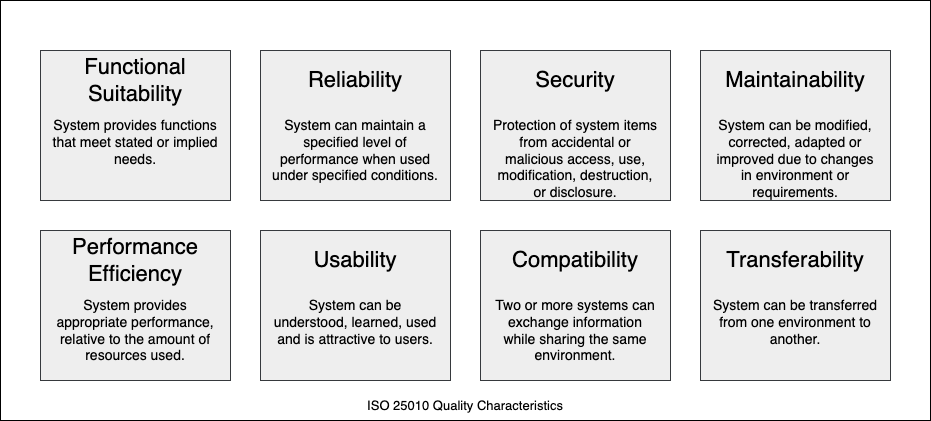

# Introduction and Goals

Describes the relevant requirements and the driving forces that software
architects and development teams must consider. These include:

- Underlying business goals
- Essential features
- Essential functional requirements
- Quality goals for the architecture
- Relevant stakeholders and their expectations

## Requirements Overview

**Contents**: Short description of the functional requirements, driving forces, extract (or abstract) of requirements. Link to (hopefully existing) requirements documents (with version number and information on where to find it).

**Motivation**: From the point of view of the end users a system is created or modified to improve support of a business activity and/or improve the quality.

**Form**: Short textual description, probably in tabular use-case format. If requirements documents exist this overview should refer to these documents.

Keep these excerpts as short as possible. Balance readability of this document with potential redundancy with respect to requirements documents.

## Quality Goals

**Contents**: The top three (max five) quality goals for the architecture whose fulfillment is of the highest importance to the major stakeholders. We really mean quality goals for the architecture. Don't confuse them with project goals. They are not necessarily identical.

Consider this overview of potential topics (based upon the ISO 25010 standard):

**Motivation**: You should know the quality goals of your most important stakeholders, since they will influence fundamental architectural decisions. Make sure to be very concrete about these qualities, avoid buzzwords.

**Form**: A table with quality goals and concrete scenarios, ordered by priorities.

## Stakeholders

**Contents**: Explicit overview of stakeholders of the system, i.e., all persons, roles or organizations that:

- Should know the architecture
- Have to be convinced of the architecture
- Have to work with the architecture or with code
- Need the documentation of the architecture for their work
- Have to come up with decisions about the system or its development

**Motivation**: You should know all parties involved in the development of the system or affected by the system. Otherwise, you may get nasty surprises later in the development process. These stakeholders determine the extent and the level of detail of your work and its results.

**Form**: Table with role names, person names, and their expectations with respect to the architecture and its documentation.

| Role/Name | Contact | Expectations |
| --------- | ------- | ------------ |
| _\<Role-1>_ | _\<Contact-1>_ | _\<Expectation-1>_ |
| _\<Role-2>_ | _\<Contact-2>_ | _\<Expectation-2>_ |

# Architecture Constraints

**Contents**: Any requirement that constraints software architects in their freedom of design and implementation decisions or decision about the development process. These constraints sometimes go beyond individual systems and are valid for whole organizations and companies.

**Motivation**: Architects should know exactly where they are free in their design decisions and where they must adhere to constraints. Constraints must always be dealt with; they may be negotiable, though.

**Form**: Simple tables of constraints with explanations. If needed you can subdivide them into technical constraints, organizational and political constraints and conventions (e.g., programming or versioning guidelines, documentation or naming conventions).

# System Scope and Context

**Contents**: System scope and context - as the name suggests - delimits your system (i.e., your scope) from all its communication partners (neighboring systems and users, i.e., the context of your system). It thereby specifies the external interfaces.

If necessary, differentiate the business context (domain-specific inputs and outputs) from the technical context (channels, protocols, hardware).

**Motivation**: The domain interfaces and technical interfaces to communication partners are among your system's most critical aspects. Make sure that you completely understand them.

**Form**: Various options:

- Context diagrams
- Lists of communication partners and their interfaces

## Business Context

**Contents**: Specification of **all** communication partners (users, IT systems, ...) with explanations of domain-specific inputs and outputs or interfaces. Optionally you can add domain-specific formats or communication protocols.

**Motivation**: All stakeholders should understand which data are exchanged with the environment of the system.

**Form**: All kinds of diagrams that show the system as a black box and specify the domain interfaces to communication partners.

Alternatively (or additionally) you can use a table. The title of the table is the name of your system, the three columns contain the name of the communication partner, the inputs, and the outputs.

**\<Diagram or Table>**

**\<optionally: Explanation of external domain interfaces>**

## Technical Context

**Contents**: Technical interfaces (channels and transmission media) linking your system to its environment. In addition a mapping of domain-specific input/output to the channels, i.e., an explanation of which I/O uses which channel.

**Motivation**: Many stakeholders make architectural decisions based on the technical interfaces between the system and its context. Especially infrastructure or hardware designers decide these technical interfaces.

**Form**: E.g., UML deployment diagram describing channels to neighboring systems, together with a mapping table showing the relationships between channels and input/output.

**\<Diagram or Table>**

**\<optionally: Explanation of technical interfaces>**

**\<Mapping Input/Output to Channels>**

# Solution Strategy

**Contents**: A short summary and explanation of the fundamental decisions and solution strategies, that shape system architecture. It includes:

- Technology decisions
- Decisions about the top-level decomposition of the system, e.g., usage of an architectural pattern or design pattern
- Decisions on how to achieve key quality goals
- Relevant organizational decisions, e.g., selecting a development process or delegating certain tasks to third parties

**Motivation**: These decisions form the cornerstones for your architecture. They are the foundation for many other detailed decisions or implementation rules.

**Form**: Keep the explanations of such key decisions short.

Motivate what was decided and why it was decided that way, based upon problem statement, quality goals, and key constraints. Refer to details in the following sections.

# Building Block View

**Content**: The building block view shows the static decomposition of the system into building blocks (modules, components, subsystems, classes, interfaces, packages, libraries, frameworks, layers, partitions, tiers, functions, macros, operations, data structures, ...) as well as their dependencies (relationships, associations, ...).

This view is mandatory for every architecture documentation. In analogy to a house, this is the *floor plan*.

**Motivation**: Maintain an overview of your source code by making its structure understandable through abstraction.

This allows you to communicate with your stakeholders on an abstract level without disclosing implementation details.

**Form**: The building block view is a hierarchical collection of black boxes and white boxes (see figure below) and their descriptions.

**Level 1** is the white box description of the overall system together with black box descriptions of all contained building blocks.

**Level 2** zooms into some building blocks of level 1. Thus it contains the white box description of selected building blocks of level 1, together with black box descriptions of their internal building blocks.

**Level 3** zooms into selected building blocks of level 2, and so on.

## Whitebox Overall System

Here you describe the decomposition of the overall system using the following white box template. It contains:

- An overview diagram
- A motivation for the decomposition
- Black box descriptions of the contained building blocks. For these, we offer you alternatives:
  - Use *one* table for a short and pragmatic overview of all contained building blocks and their interfaces
  - Use a list of black box descriptions of the building blocks according to the black box template (see below). Depending on your choice of tool this list could be sub-chapters (in text files), sub-pages (in a Wiki), or nested elements (in a modeling tool).

- (Optional:) important interfaces, that are not explained in the black box templates of a building block, but are very important for understanding the white box. Since there are so many ways to specify interfaces why do not provide a specific template for them. In the worst case, you have to specify and describe syntax, semantics, protocols, error handling, restrictions, versions, qualities, necessary compatibilities, and many things more. In the best case you will get away with examples or simple signatures.

**\<Overview Diagram>**

**Motivation**: *\<text explanation>*

**Contained Building Blocks**: *\<Description of contained building block (black boxes)>*

**Important Interfaces**: *\<Description of important interfaces>*

Insert your explanations of black boxes from level 1:

If you use tabular form you will only describe your black boxes with name and responsibility according to the following schema:

| **Name** | **Responsibility** |
| -------- | ------------------ |
| _\<black box 1>_ | _\<Text>_ |
| _\<black box 2>_ | _\<Text>_ |

If you use a list of black box descriptions then you fill in a separate black box template for every important building block. Its headline is the name of the black box.

### \<Name black box 1>

Here you describe \<black box 1> according to the following black box template:

- Purpose/Responsibility
- Interface(s), when they are not extracted as separate paragraphs. These interfaces may include qualities and performance characteristics.
- (Optional) Quality/Performance characteristics of the black box, e.g., availability, run-time behavior, ....
- (Optional) directory/file location (if applicable).
- (Optional) Fulfilled requirements or influencing quality goals.

### \<Name black box 2>

...

## Level 2

Insert the white box descriptions of level 1 building blocks that need to be refined here. In doing this, you can copy the structure of the previous section (white box template) for each refined building block.

### White Box \<Name of Building Block>

## Level 3

Continue with the refined building blocks of level 2 analogously.

# Runtime View

**Contents**: The runtime view describes concrete behavior and interactions of the system’s building blocks in the form of scenarios from the following areas:

- Important use cases or features: how do building blocks execute them?
- Interactions at critical external interfaces: how do building blocks cooperate with users and neighboring systems?
- Operation and administration: launch, start-up, stop
- Error and exception scenarios

**Motivation**: You want to understand how (instances of) building blocks perform their tasks and communicate at runtime. The main focus of this view is on the sequence of building block interactions.

**Form**: A common practice is to use UML sequence or activity diagrams for the representation of scenarios.

## \<Runtime Scenario 1>

Here you describe one runtime scenario. Choose those scenarios according to the following criteria:

- They represent frequent or important interactions.
- They are sources of misunderstandings or are critical with respect to non-functional requirements.

**\<Diagram>**

**\<textual description, e.g., steps>**

## \<Runtime Scenario 2>

...

# Deployment View

**Content**: The deployment view describes the technical infrastructure used to execute your system. It shows the system’s building blocks (from the building block view) and their allocation to the infrastructure elements.

The deployment view is especially important if your software is executed as distributed systems with more than one computer or similar infrastructure element, i.e., as soon as you distribute your building blocks to more than one technical infrastructure element.

**Motivation**: Software does not run without hardware. This part of the architecture description is about how your software is mapped to the technical infrastructure. This includes the mapping to hardware as well as to infrastructure software, such as operating systems, app servers, or databases.

For many systems, it is also important to show the physical layers and physical distribution (e.g., over data centers), as these can influence the system’s quality requirements.

**Form**: UML deployment diagrams or any alternative, but always with element descriptions. Alternatively (or additionally) you can use tables to describe environments and environments-specific configurations and topologies.

## Infrastructure Level 1

**\<Overview Diagram>**

**Motivation**: *\<text explanation>*

**Quality and/or Performance Features**: *\<explanation or reference to scenarios in section 8)*

**Mapping of Building Blocks to Infrastructure**: *\<Mapping table or table of references>*

## Infrastructure Level 2

**\<Overview Diagram>**

**Motivation**: *\<text explanation>*

**Quality and/or Performance Features**: *\<explanation or reference to scenarios in section 8)*

**Mapping of Building Blocks to Infrastructure**: *\<Mapping table or table of references>*

# Cross-cutting Concepts

**Content**: Concepts that influence more than one building block, such as:

- Domain models
- Architecture or design patterns
- Rules for using specific technology
- Principal guidelines for the realization of quality requirements
- (often centrally provided) infrastructure such as identity and access management or configuration
- Concepts of persistence or (global) error handling
- Key mechanisms

**Motivation**: Developers often experience recurring problems when implementing similar features. Concepts provide proven solutions for these problems that you want to standardize in your system.

For every significant concept, you should explain:
- Which problem shall be solved with the concept?
- What is the essence of the concept and its solution?
- Which alternatives exist to the concept?

**Form**: No specific format, but you should always provide a motivation for the concept, solution, and implementation hints.

# Architecture Decisions

**Contents**: Important, expensive, large scale, risky, and typically (for non-architects) invisible architecture decisions including:

- The decision itself
- The reason or motivation why this was decided the way it was
- The possible consequences of the decision, including possible implications on other decisions

This includes especially those decisions that were hard to make, are meaningful or demanding considerable efforts during their evaluation.

**Motivation**: You should understand significant architecture decisions.

You should also be able to identify decisions that need to be re-evaluated once the system undergoes changes or if the boundary conditions change.

**Form**: We suggest the use of a simple tabular format that contains the elements described above.

| Decision | Outcome | Description |
| -------- | ------- | ----------- |
| _\<identifier>_ | _\<selected alternative>_ | _\<text>_ |

# Quality Requirements

**Content**: Quality requirements as quality tree and scenarios

**Motivation**: Quality requirements are as important as functional requirements. They are crucial for architectural decisions, but they are often implicit or not as concrete as functional requirements. Therefore this section makes them visible.

## Quality Tree

**Content**: Quality goals and requirements as a quality tree

**Motivation**: Overview of quality requirements

**Form**: Quality tree (graphic), often structured along the quality model you use

## Quality Scenarios

**Contents**: Quality scenarios make quality requirements tangible and vivid. They contain a source (of the stimulus), the stimulus itself, the environment, the system (the artifact), the response, and the response measure.

**Motivation**: You should make quality requirements visible, tangible, and concrete in order to ensure their fulfillment.

**Form**: Table containing the scenario parts: source, stimulus, environment, artifact, response, and response measure. Alternatively: UML sequence diagrams or activity diagrams

# Risks and Technical Debt

## Risks

**Content**: Known and potential risks to the success of the system (project). Typically limited to technical risks, i.e., topics that might impact the architecture or can be solved by the architecture.

**Motivation**: Communicate risks early and regularly. It is much cheaper to mitigate risks early.

**Form**: Simple tabular format. 

## Technical Debt

**Content**: Known existing technical debt and planned refactoring actions.

**Motivation**: Make technical debt visible and explain why it is necessary to carry it, to enable fact-based decisions about how to proceed with technical debt.

**Form**: Simple tabular format. 

# Glossary

The most important terms that stakeholders use when discussing or reading about the system. These can be domain-specific terms or technical terms.

- Make sure that stakeholders know what the terms mean.
- Avoid misunderstandings caused by ambiguous terms.

A glossary is also a helpful means to bridge communication barriers between disciplines (such as between business and IT) and maybe an ideal way to get a shared understanding of a task.

**Motivation**: Stakeholders often use terms or abbreviations that not everyone might understand. These terms need to be defined or translated.

**Form**: List with important domain or technical terms and their definitions

## Terms

| Term | Definition |
| ---- | ---------- |
| _\<Term-1>_ | _\<Definition-1>_ |
| _\<Term-2>_ | _\<Definition-2>_ |

## Abbreviations

| Abbreviation | Definition |
| ------------ | ---------- |
| _\<Abbreviation-1>_ | _\<Definition-1>_ |
| _\<Abbreviation-2>_ | _\<Definition-2>_ |
